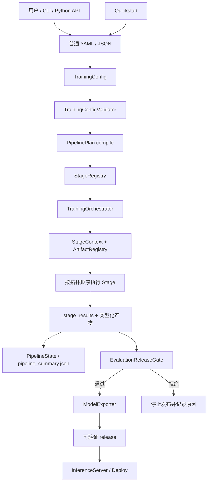
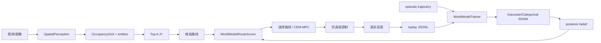

# SaddleLLM 目录结构、文件原理与整体流程

> 适用版本：`2.33`<br>
> 源码范围：`saddlellm/`、兼容包 `saddle_llm/`、主要工程目录。<br>
> 本文回答三个问题：代码放在哪里、每个文件负责什么、一次任务如何从入口走到产物。

如需查看类和函数的精确签名、源码行号及静态调用对象，请配合阅读
[docs/FUNCTION_REFERENCE.md](docs/FUNCTION_REFERENCE.md)；更深入的架构边界和时序图见
[docs/ARCHITECTURE.md](docs/ARCHITECTURE.md)。

## 1. 系统一句话模型

SaddleLLM 不是单一 Trainer，而是一套以“统一配置 + Stage 编排 + 类型化产物”为主线的训练与推理框架：

```text
用户意图
  → 普通 YAML/JSON（顶层 stages）
  → TrainingConfig
  → PipelinePlan + StageRegistry
  → TrainingOrchestrator
  → 专用数据、模型、训练、评测或空间执行器
  → checkpoint / report / release / replay 等标准产物
```

代码组织遵循以下边界：

1. 顶层包只负责公共入口、延迟导出和少量兼容转发。
2. `factory/` 把用户意图编译成配置，但不承担实际训练。
3. `framework/` 定义稳定控制面，不直接依赖 Torch/Transformers。
4. `training/TrainingOrchestrator.py` 负责调度，不重复实现各算法。
5. 领域子包负责自己的数据契约、算法和产物。
6. 评测决定是否允许发布，导出负责生成可验证 release，服务层只加载完整产物。

## 2. 仓库目录结构

```text
build-saddlellm/
├─ saddlellm/                 # 主 Python 包
│  ├─ agents/                 # 模型提供方与 agent 算子
│  ├─ alignment/              # 对齐、RLHF、GRPO、安全生成
│  ├─ compression/            # 量化、剪枝、轻量化
│  ├─ data/                   # 数据管线、清洗、配比、检查
│  ├─ distillation/           # 通用、快速、on-policy 蒸馏
│  ├─ evaluation/             # 评测、基准、冒烟测试、发布门禁
│  ├─ experiments/            # 实验计划、追踪、报告、稳定性
│  ├─ factory/                # Quickstart、训练工厂、后端规划
│  ├─ framework/              # DAG、Stage、插件、产物协议
│  ├─ models/                 # 模型蓝图、构建、加载、Tokenizer
│  ├─ multimodal/             # 图像/音频/视频生成、VLM、VLA
│  ├─ runtime/                # 导出、推理服务、部署、UI、监控
│  ├─ spatial/                # 空间感知、路径规划、控制、WorldAgent
│  ├─ training/               # 训练编排、预训练、后训练、分布式
│  ├─ tuning/                 # LoRA、Prompt、TRL、Swift、Unsloth
│  ├─ utils/                  # 可选依赖与训练诊断
│  ├─ world_models/           # RSSM 世界模型、数据、训练、推理
│  └─ spatial_studio_web/     # 随 wheel 发布的前端构建产物
├─ saddle_llm/                # 旧包名兼容命名空间
├─ spatial-studio/            # React/Vite 空间工作台源码
├─ configs/                   # 可运行的 YAML 配置示例
├─ data/                      # 小型 JSONL/JSON/PBM 示例数据
├─ examples/                  # Python 使用示例
├─ tests/                     # 单元、集成、发布契约测试
├─ tools/                     # 文档生成和发布一致性检查
├─ docs/                      # 架构、插件、多模态等专题文档
├─ design/                    # UI 设计稿和设计契约
├─ paper/                     # 论文 LaTeX 源码
├─ external_research/         # 外部研究代码，仅供参考
├─ reference/                 # 外部参考资料，不属于运行时
├─ build/、dist/、outputs/    # 可再生成的构建/运行产物
├─ pyproject.toml             # 包元数据、依赖分组、CLI、打包规则
├─ pytest.ini                 # 测试配置
├─ requirements-*.txt         # 场景化锁定依赖
└─ README.md                  # 项目入口说明
```

### 2.1 源码与产物边界

| 目录 | 是否是一方源码 | 说明 |
|---|---:|---|
| `saddlellm/`、`saddle_llm/` | 是 | Python 运行时与兼容层 |
| `spatial-studio/src/` | 是 | 空间工作台前端源码 |
| `configs/`、`data/`、`examples/` | 是 | 配置、样例和调用方式 |
| `tests/`、`tools/` | 是 | 质量门禁和工程工具 |
| `external_research/`、`reference/` | 否 | 研究参考，不应被运行时代码反向依赖 |
| `build/`、`dist/`、`outputs/` | 否 | 可删除并重新生成的产物，不应作为源码导入 |

### 2.2 导入约定

新代码优先使用领域路径：

```python
from saddlellm.models.ModelLoader import load_causal_lm
from saddlellm.training.TrainingOrchestrator import TrainingOrchestrator
from saddlellm.spatial.WorldAgent import WorldAgentRuntime
```

稳定公共对象可直接从顶层导入，实际模块由 `_exports.py` 延迟加载：

```python
from saddlellm import ModelBlueprint, DataPipeline, TrainingOrchestrator
```

`saddle_llm` 只保留旧包名兼容。历史平铺模块不再全部保留；仅下面五个顶层模块继续转发：

```text
DataPipeline.py  TextProcess.py  Lightweight.py
ModelPruner.py   ModelQuantizer.py
```

## 3. 文件级代码原理

本节覆盖当前 155 个一方 Python 源文件（`saddlellm` 154 个、旧命名空间 1 个）。`__init__.py` 的共同原则是声明领域边界；除明确说明外，不在包导入时加载重型依赖。

### 3.1 公共入口和兼容层

| 文件 | 代码原理与职责 |
|---|---|
| `saddlellm/__init__.py` | 顶层公共 API。通过 `__getattr__` 按需调用 `import_module`，避免 `import saddlellm` 时立即加载 Torch、Transformers、FastAPI 等依赖。 |
| `saddlellm/_exports.py` | 公共符号到“模块 + 属性”的唯一映射表；`__all__` 和延迟导入均由它派生，避免两套 API 清单漂移。 |
| `saddlellm/cli.py` | Console 入口。只解析参数并分派到 factory、validator、orchestrator、world model、spatial、export、serve 等领域入口。 |
| `saddlellm/easy.py` | 面向交互实验的便捷门面，把创建、训练、蒸馏、评测、聊天等常见操作压缩为较少参数；生产任务建议使用统一配置。 |
| `saddlellm/DataPipeline.py` | `data.pipeline` 的旧导入路径 shim，不保存实现。 |
| `saddlellm/TextProcess.py` | `data.text_processing` 的旧导入路径 shim，不保存实现。 |
| `saddlellm/Lightweight.py` | `compression.lightweight` 的旧导入路径 shim。 |
| `saddlellm/ModelPruner.py` | `compression.pruner` 的旧导入路径 shim。 |
| `saddlellm/ModelQuantizer.py` | `compression.quantizer` 的旧导入路径 shim。 |
| `saddle_llm/__init__.py` | 将旧包名的版本、公共属性和领域子包搜索路径转发给 `saddlellm`；不复制业务实现。 |

### 3.2 `agents/`：模型服务与可执行算子

| 文件 | 代码原理与职责 |
|---|---|
| `agents/__init__.py` | 声明 agent/model-provider 领域边界。 |
| `agents/AgentModelProvider.py` | 将 OpenAI 兼容模型配置转成 HTTP 请求；密钥只从指定环境变量读取，校验远程主机，限制重定向，并对短暂网络错误执行有限重试。 |
| `agents/AgentOperators.py` | 从 `saddle_ml.agent.operator` 转发稳定的 agent 算子协议，使实现所有权留在 agent 包，SaddleLLM 只提供接入面。 |
| `agents/RealWorldOperators.py` | 为可视化工作流提供模型加载、SFT、蒸馏、剪枝、量化、评测等可复现实算子；状态中只传 JSON 可序列化的路径、血缘和指标，不传模型对象。 |

### 3.3 `alignment/`：偏好优化、强化学习与安全

| 文件 | 代码原理与职责 |
|---|---|
| `alignment/__init__.py` | 声明对齐算法子包。 |
| `alignment/AdvancedTechniques.py` | 提供 EMA、自一致性、Evol-Instruct、模型汤和指令回译等训练质量技术；它们以独立组件组合，不侵入主编排器。 |
| `alignment/ExclusiveTechniques.py` | 集中 MTP、aux-loss-free MoE、迭代对齐、test-time compute、RLAIF、RoPE scaling、稀疏自编码器等实验组件。 |
| `alignment/FrontierAlign.py` | 将 Constitutional AI、过程奖励模型和拒绝采样封装为可串联的前沿对齐流水线。 |
| `alignment/GRPOTrainer.py` | 轻依赖 GRPO 实现；对同一 prompt 的候选组计算相对优势，再更新策略，避免依赖完整 RL 基础设施。 |
| `alignment/PublicPolicyRLVR.py` | AASB 公共政策场景的可验证 RL pilot；负责数据拆分、提示构造、答案提取、规则奖励和 benchmark 指标。 |
| `alignment/PublicPolicySFT.py` | 将公共政策样本转换为监督消息/完成格式，并执行对应 SFT 实验。 |
| `alignment/RLHFTrainer.py` | 独立的 PPO/DPO 风格包装器；按方法选择 value head、参考模型、奖励模型及可选 LoRA。 |
| `alignment/RLScaling.py` | 长推理 RL 的 rollout、角色分类、信用分配、奖励管理和缓存工具，处理轨迹级数据而非普通监督 batch。 |
| `alignment/SafeGenerate.py` | 在生成参数和输出后处理两端抑制重复、毒性和不安全文本；它是防护组件，不等同于完整安全策略系统。 |

### 3.4 `compression/`：量化、剪枝和轻量化

| 文件 | 代码原理与职责 |
|---|---|
| `compression/__init__.py` | 对 `ModelQuantizer`、`ModelPruner`、`Lightweight` 做延迟导出，保持包导入轻量。 |
| `compression/quantizer.py` | 安全的内存量化帮助类；显式校验位宽和目标，不在构造阶段下载或保存模型。 |
| `compression/pruner.py` | 安全的内存剪枝帮助类；基于参数重要性/掩码改变权重并返回统计。 |
| `compression/lightweight.py` | 根据模型规模组合量化、剪枝、KV cache 和投机解码建议，提供一键轻量化门面。 |
| `compression/quantize.py` | 面向命令行/离线任务的旧式完整量化流程，包括加载、校准、量化和测试。 |
| `compression/prune.py` | 面向命令行/离线任务的旧式剪枝训练流程，包括数据准备、稀疏化、再训练和评测。 |

### 3.5 `data/`：数据契约和预处理

| 文件 | 代码原理与职责 |
|---|---|
| `data/__init__.py` | 延迟公开数据管线与文本处理对象。 |
| `data/pipeline.py` | 预训练数据的 collect → clean → deduplicate → quality filter → tokenize/pack → iterable dataset 主链；`DataMixer` 负责多源权重混合。 |
| `data/text_processing.py` | 文本清洗、分句、语言与格式处理；可选 NLP 依赖在使用时加载，缺失时使用轻量回退。 |
| `data/DataCatalog.py` | 保存数据集元信息和质量分类规则；只描述“数据是什么、质量如何”，不把隐式下载作为目录职责。 |
| `data/DataStrategy.py` | 规划预训练语料桶和配比，并检测训练/评测数据污染。 |
| `data/DataBalance.py` | 根据多个 `DatasetConfig` 采样和平衡数据，形成可用于预训练的数据组合。 |
| `data/DatasetManifest.py` | 读写数据 manifest，将名称、路径、格式、role、权重转换为统一数据源声明。 |
| `data/PostTrainingData.py` | 将 Alpaca、messages、prompt/completion、chosen/rejected、KTO 等格式归一成后训练 schema，并输出规范化报告。 |
| `data/TrainingDataInspector.py` | 模型加载前抽样检查路径、JSONL、字段、空值和任务契约，快速失败，避免昂贵训练启动后才发现数据错误。 |

### 3.6 `distillation/`：教师—学生学习

| 文件 | 代码原理与职责 |
|---|---|
| `distillation/__init__.py` | 声明蒸馏领域；具体实现按需导入。 |
| `distillation/UniversalDistiller.py` | 用 `TeacherInterface` 抹平本地模型和远程教师差异；支持多教师、能力定向和自动蒸馏。 |
| `distillation/OnPolicyDistillation.py` | 当前策略生成 rollout，再由一个或多个教师返回信号，生成 MOPD 后训练数据。 |
| `distillation/RapidDistill.py` | 管理教师画像、本地教师池、API 并发和智能路由，面向快速构造蒸馏数据。 |
| `distillation/DistillationTrainer.py` | 较简洁的教师 logits—学生 logits 蒸馏训练入口。 |
| `distillation/distill.py` | 完整旧式 CLI 蒸馏脚本，组合温度 KL、监督损失、数据加载和 Trainer。 |

### 3.7 `evaluation/`：评测和发布门禁

| 文件 | 代码原理与职责 |
|---|---|
| `evaluation/__init__.py` | 声明评测、门禁和 smoke test 领域。 |
| `evaluation/LLModelEvalute.py` | 通用模型评测器和 CLI；加载模型/数据并生成任务指标。文件名保留历史拼写以维持公共符号。 |
| `evaluation/BenchmarkRunner.py` | 以统一 `EvalResult` 运行多模型/多规模 benchmark，并汇总对比结果。 |
| `evaluation/PretrainEvalSuite.py` | 用 `EvalTaskSpec` 组织预训练评测任务，产生统一 suite 结果。 |
| `evaluation/ReleaseGate.py` | 将指标阈值、必需检查和失败原因归一成 `ReleaseGateResult`；未通过时导出必须 fail closed。 |
| `evaluation/SmokeTestRunner.py` | 在本地小模型/小数据上运行端到端 SFT、VLA、偏好训练 smoke test，验证环境和主调用链。 |

### 3.8 `experiments/`：实验管理和训练观测

| 文件 | 代码原理与职责 |
|---|---|
| `experiments/__init__.py` | 声明实验计划、追踪和报告领域。 |
| `experiments/ExperimentTracker.py` | 统一本地日志、TensorBoard、W&B 等追踪后端，使训练代码只调用一个追踪接口。 |
| `experiments/ModelExperimentPlanner.py` | 从模型蓝图生成受控架构变量组合和实验 bundle，保证对照实验只改变指定维度。 |
| `experiments/PretrainExperimentRunner.py` | 编排低成本预训练网格，记录每个运行 manifest 和汇总 bundle。 |
| `experiments/PretrainReport.py` | 聚合 checkpoint、日志、指标和异常，形成结构化发现与报告。 |
| `experiments/PretrainStability.py` | 通过 callback 监测 NaN、梯度、损失异常和 checkpoint 可用性。 |
| `experiments/CurriculumScheduler.py` | 按阶段配置调整训练任务或样本难度，实现课程学习调度。 |
| `experiments/ScalingLawAnalyzer.py` | 根据参数量、token 和历史运行拟合/应用 scaling law，生成预训练规模计划。 |
| `experiments/TrainingMonitor.py` | 估算 MFU、吞吐和资源效率，记录训练过程中可比较的性能指标。 |

### 3.9 `factory/`：从意图到可执行配置

| 文件 | 代码原理与职责 |
|---|---|
| `factory/__init__.py` | 暴露轻量 `QuickstartResult` 和 `create_quickstart`，声明工厂领域。 |
| `factory/Quickstart.py` | 生成最小工作区、样例数据、统一配置和下一步命令；默认不下载模型、不启动训练、不覆盖已有文件。 |
| `factory/TrainingFactory.py` | 高层项目工厂；创建工作区、模型实验、预训练/后训练/MOPD/VLA 计划，但把实际执行交给 orchestrator。 |
| `factory/DomainBuilder.py` | 将常见行业/领域训练需求套入可复用领域预设，生成模型工作流。 |
| `factory/FactoryBackendPlanner.py` | 根据参数量、显存、GPU 数、序列长度和任务阶段计算并行与后端建议。 |
| `factory/BackendAdapters.py` | 把规范后端计划翻译为单机、torchrun、DeepSpeed 等启动命令和 PowerShell 脚本。 |
| `factory/TrainingStrategyAdvisor.py` | 用预算和硬件约束评估 full/LoRA/QLoRA/预训练等路线的可行性与风险。 |

### 3.10 `framework/`：稳定控制面

| 文件 | 代码原理与职责 |
|---|---|
| `framework/__init__.py` | 汇总稳定协议对象；保持对训练框架重依赖的隔离。 |
| `framework/pipeline.py` | 将线性 stage 或显式依赖编译为确定性 DAG；检测重复、未知依赖和环，并用 fingerprint 支持安全恢复。 |
| `framework/stages.py` | 定义 `StagePlugin`、`StageContext`、能力声明和内置 stage 映射；通过 `saddlellm.stages` entry point 延迟发现插件。 |
| `framework/registry.py` | 通用惰性插件注册表；保证名称规范化、来源可追踪、重复注册和加载失败可诊断。 |
| `framework/artifacts.py` | 用 `ArtifactRef`/`ArtifactRegistry` 记录类型、路径、生产 stage 和血缘，代替阶段之间传递含糊字典。 |

### 3.11 `models/`：模型设计、构造和加载

| 文件 | 代码原理与职责 |
|---|---|
| `models/__init__.py` | 声明模型与 tokenizer 领域。 |
| `models/Architecture.py` | 维护模型架构能力矩阵；在执行前判断某种 stage/特性是否受支持。 |
| `models/ModelRegistry.py` | 管理从小模型到大模型的已知规格，提供参数量、架构和训练规模估算入口。 |
| `models/ModelBlueprint.py` | 可序列化的设计时模型结构；校验 attention、FFN、MoE、残差、vision/projector 等组件组合并分析成本。 |
| `models/ModelBuilder.py` | 代码优先的链式构建器；从组件 registry 组合 blueprint，最终仍复用同一规范化/校验逻辑。 |
| `models/SaddleModeling.py` | 原生 decoder-only Torch 实现，包含 RMSNorm、RoPE、attention、SwiGLU、MoE、decoder layer、loss、generate 和 checkpoint 生命周期。 |
| `models/OperatorBackends.py` | 注册 eager、SDPA、xFormers 等 attention 后端；模型层按统一签名选择实现。 |
| `models/ModelAdapter.py` | 抽象原生 Saddle 与 Hugging Face 模型能力，让 orchestrator 在运行前校验 stage、量化和保存能力。 |
| `models/ModelLoader.py` | 统一识别并加载原生 checkpoint 或 Hugging Face Causal LM；本地原生目录不完整时明确报错，不静默换后端。 |
| `models/ModelMetrics.py` | 从模型结构/训练回调提取参数、MoE、层级等指标，生成可比较快照。 |
| `models/TokenizerTrainer.py` | 训练、保存并评估 BPE/SentencePiece tokenizer，输出 `TokenizerEvalResult`。 |
| `models/TokenizerLoader.py` | 同时兼容标准 tokenizer 目录和仅含 `tokenizer.json` 的轻量产物。 |
| `models/LLMLoader.py` | 较早的模型加载包装器，包含量化/设备等便捷配置；新生命周期优先使用 `ModelLoader.py`。 |
| `models/load_model.py` | 保留 Unsloth、Transformers LoRA 和源码模式加载函数，作为旧后端适配入口。 |

### 3.12 `multimodal/`：多模态、生成模型和 VLA

| 文件 | 代码原理与职责 |
|---|---|
| `multimodal/__init__.py` | 声明多模态建模、媒体生成和 VLA 领域。 |
| `multimodal/ModalityCodec.py` | 定义图像、音频、视频 latent codec 协议和 registry，使缓存/训练不绑定具体编码器。 |
| `multimodal/BuiltinMediaCodecs.py` | 提供依赖较轻的基线图像、WAV、视频帧 codec 与文本条件编码器；生产 codec 可通过 registry 替换。 |
| `multimodal/MediaCache.py` | 将原始媒体清单编码为可续建 NPZ 分片；用输入指纹、原子 manifest 和 shard 校验保证恢复一致性。 |
| `multimodal/MultimodalData.py` | 把文本、图像、音频、视频和 episode 记录归一为版本化 segment/asset/sample 契约。 |
| `multimodal/VisionBackbones.py` | 注册 tiny patch 与 Hugging Face vision backbone，并统一输出视觉特征。 |
| `multimodal/MultimodalProjector.py` | 用 linear、MLP、gated MLP 或 resampler 将视觉特征映射到语言模型 embedding 空间。 |
| `multimodal/MultimodalModeling.py` | LLaVA 风格 decoder-only 包装器：编码图像、投影视觉 token、与文本 embedding 拼接后交给语言模型。 |
| `multimodal/SaddleMultimodalModeling.py` | 早期多模态类名的兼容转发，实际实现位于 `MultimodalModeling.py`。 |
| `multimodal/LatentFlowModel.py` | 图像 latent 的条件 flow-matching Transformer，通过时间嵌入和文本条件预测速度场。 |
| `multimodal/LatentFlowTrainer.py` | 读取缓存 latent，采样时间/噪声，训练 flow objective，并管理 checkpoint 保存恢复。 |
| `multimodal/MusicCodeModel.py` | 对残差音频 codec 的多码本 token 做文本条件自回归建模。 |
| `multimodal/MusicCodeTrainer.py` | 训练音乐 code 模型，处理多码本 batch、AMP、学习率和 checkpoint。 |
| `multimodal/VideoLatentFlowModel.py` | 在因果视频 codec latent 上执行文本条件时空 flow matching。 |
| `multimodal/VideoLatentFlowTrainer.py` | 读取视频 latent clip，训练视频 flow 模型并维护 checkpoint 生命周期。 |
| `multimodal/VLA.py` | 定义动作空间、动作 token、VLA 样本、dataset/collator 和训练规划，把连续/离散动作接到语言模型。 |
| `multimodal/VLADataInspector.py` | 在训练前检查 VLA 轨迹、媒体路径、动作维度和 schema。 |
| `multimodal/VLATrainer.py` | 执行 VLA 行为克隆；负责规范化、拆分、模型输入 collator、量化/LoRA 和训练参数。 |

### 3.13 `runtime/`：发布、服务和观测

| 文件 | 代码原理与职责 |
|---|---|
| `runtime/__init__.py` | 声明部署、服务、UI、导出和监控领域。 |
| `runtime/ModelExporter.py` | 将原生/HF/adapter checkpoint 打包为稳定 release；写入清单、哈希和元数据，并可执行加载校验。 |
| `runtime/InferenceServer.py` | 从完整 release 构建 OpenAI 兼容的非流式 FastAPI 服务，处理 chat template、长度、stop 和 token 统计。 |
| `runtime/Deploy.py` | 一键部署门面，组合模型准备、可选轻量化和 API 启动。 |
| `runtime/ChatUI.py` | 基于便捷 API 的聊天 Web UI 包装。 |
| `runtime/monitordashbord.py` | FastAPI/WebSocket 监控服务，接收指标、暴露系统状态和告警页面。 |

### 3.14 `spatial/`：空间智能和 WorldAgent

| 文件 | 代码原理与职责 |
|---|---|
| `spatial/__init__.py` | 声明空间感知、规划、控制、agent 和 API 领域。 |
| `spatial/SpatialPerception.py` | 将图像转换为空间语义与占用栅格；几何提取可独立工作，Qwen-VL 分析器作为可选语义增强。 |
| `spatial/SpatialPlanner.py` | 定义占用栅格和 Top-K A*；通过多样性惩罚生成不同可通行候选路线。 |
| `spatial/SpatialWorldModel.py` | 把视觉语义、栅格、路线规划和世界模型评分组合起来；可用 RSSM 想象结果重排路线。 |
| `spatial/SpatialWorldModelControl.py` | 闭环 latent MPC；循环观测、更新 belief、用 CEM 规划、执行首个动作并重新规划。 |
| `spatial/SpatialWorldModelData.py` | 将地图、路径和动作构造成 RSSM episode/window，生成空间世界模型训练 JSONL。 |
| `spatial/SpatialWorldModelEvaluation.py` | 只从真实首帧建立 posterior，随后 action-conditioned rollout；计算 occupancy、reward、motion、collision、漂移和校准指标。 |
| `spatial/SpatialVisualization.py` | 将空间状态、候选路线和实体输出为 JSON、HTML、PNG 与 occupancy mask。 |
| `spatial/SpatialAPI.py` | 面向 Spatial Studio 的 FastAPI 应用；管理上传、任务目录、规划执行和结果文件。 |
| `spatial/WorldAgent.py` | 有状态 agent runtime；持久化 observation/state/plan/simulation/feedback，并将真实反馈追加为 replay。 |
| `spatial/WorldAgentAPI.py` | 为 analyze、plan、simulate、feedback 等 WorldAgent 操作提供 HTTP schema、路由和统一错误处理。 |
| `spatial/prosthetic_eye_control.py` | 安全优先的双轴假眼/机器人眼控制；组合安全包络、PID、plant simulator 和训练数据生成。 |

### 3.15 `training/`：训练执行和统一编排

| 文件 | 代码原理与职责 |
|---|---|
| `training/__init__.py` | 声明训练编排、分布式和 Trainer 实现领域。 |
| `training/TrainingOrchestrator.py` | 全框架执行枢纽。解析 `TrainingConfig`、编译 DAG、校验能力/数据/分布式约束、创建 StageContext、调度 stage、传递产物并写汇总。 |
| `training/TrainingConfigValidator.py` | 不加载大模型即可检查 stage、路径、超参数、后端、release gate、VLA/世界模型等静态契约。 |
| `training/TrainingPlanEstimator.py` | 确定性估算有效 batch、step 和 token 量，用于计划检查，不冒充真实耗时预测。 |
| `training/DistributedConfig.py` | 将统一分布式配置转换为 DDP、FSDP、DeepSpeed ZeRO 等后端参数。 |
| `training/DistributedRuntime.py` | 从环境变量读取 rank/world size，校验 stage 是否支持当前策略并提供 barrier；不依赖重型训练框架。 |
| `training/DensePretrainer.py` | 稠密模型预训练实现，提供模型规模配置、初始化策略、稳定性控制和训练入口。 |
| `training/pretrain.py` | 较早的独立 HF 预训练脚本；支持加载已有模型或按固定架构从头创建。主流程优先走 orchestrator。 |
| `training/PeftSFTTrainer.py` | 稳定 SFT/LoRA/QLoRA 入口；先规范数据和设备/精度，再按已安装 TRL/Transformers 能力构造 Trainer。 |
| `training/Preference.py` | 统一 DPO、ORPO、KTO；归一 chosen/rejected/label 数据并适配不同 TRL 版本的参数签名。 |
| `training/NativePostTraining.py` | 对原生 Saddle checkpoint 执行 full-parameter SFT/DPO，包含特征编码、collator、序列 log-prob 和训练参数。 |
| `training/NativeTrainer.py` | 将原生模型的 `save_pretrained` 契约接入 Hugging Face Trainer checkpoint 生命周期。 |
| `training/PostTrainingCompatibility.py` | 探测 post-training 依赖版本和可用参数，通过签名过滤适配 PEFT/TRL 版本差异。 |

### 3.16 `tuning/`：训练后端适配器

| 文件 | 代码原理与职责 |
|---|---|
| `tuning/__init__.py` | 声明 LoRA、Prompt、全参和第三方训练后端适配领域。 |
| `tuning/LoRATuner.py` | sklearn 风格 LoRA/QLoRA 包装器；显式模型、量化、adapter 和目标层配置。 |
| `tuning/PromptTuner.py` | 包装 soft prompt 与 prefix tuning，通过虚拟 token 训练而不全面更新基础模型。 |
| `tuning/TRLFullFineTuner.py` | 使用 TRL/Transformers 执行全参数 SFT，并提供生成验证。 |
| `tuning/SwiftFullFineTuner.py` | 面向 ModelScope Swift 的全参数微调适配。 |
| `tuning/UnslothFineTuner.py` | 面向 Unsloth 的快速微调、训练数据生成、checkpoint 测试和评估。 |
| `tuning/UnslothSFTTrainer.py` | 保留早期 Unsloth SFT 函数入口，供旧调用迁移。 |

### 3.17 `utils/`：共享工具

| 文件 | 代码原理与职责 |
|---|---|
| `utils/__init__.py` | 声明依赖与训练工具领域。 |
| `utils/OptionalDependencies.py` | 在功能真正使用时才校验发行包及版本，并生成带安装建议的错误，避免可选能力污染基础导入。 |
| `utils/TrainerUtils.py` | 环境检查、训练诊断、报告卡、EarlyStopping 和小模型自动训练等通用辅助。 |

### 3.18 `world_models/`：原生 RSSM 世界模型

| 文件 | 代码原理与职责 |
|---|---|
| `world_models/__init__.py` | 声明世界模型架构、数据、训练和推理领域。 |
| `world_models/_WorldModel.py` | Gaussian RSSM：观测编码、确定/随机状态转移、posterior/prior、观测/奖励/继续头以及 latent imagination。 |
| `world_models/_CategoricalWorldModel.py` | 离散 RSSM：categorical stochastic state、symlog/two-hot value、分组线性层和对应训练输出。 |
| `world_models/WorldModelBackends.py` | 对后端名做规范化，按配置创建模型，并从 checkpoint 元数据选择正确模型类。 |
| `world_models/WorldModelData.py` | 加载 JSON/JSONL/NPZ/Torch 轨迹，归一 episode/transition，按完整 episode 切分并生成定长窗口和 mask。 |
| `world_models/_WorldModelTrainer.py` | 独立训练器；负责数据准备、优化、AMP、梯度裁剪、验证、best checkpoint 和训练历史。 |
| `world_models/WorldModelInference.py` | 从当前观测建立 belief，执行 filter/rollout，评分候选动作，并用 random shooting/CEM 规划。 |

### 3.19 `spatial_studio_web/` 与前端源码

| 文件/目录 | 代码原理与职责 |
|---|---|
| `saddlellm/spatial_studio_web/index.html` | 随 Python wheel 发布的 Spatial Studio 页面入口。 |
| `saddlellm/spatial_studio_web/assets/*.js, *.css` | Vite 构建后的静态资源；由 `spatial-studio/` 生成，不应手工修改。 |
| `spatial-studio/src/App.tsx` | 前端状态与工作区总编排。 |
| `spatial-studio/src/api/spatialApi.ts` | 对 `SpatialAPI` 的类型化 HTTP 客户端。 |
| `spatial-studio/src/components/` | 地图、工作流、检查器、上传、导航和响应式命令组件。 |
| `spatial-studio/src/lib/` | 路线、偏好和视图状态等纯前端逻辑。 |

## 4. 整体执行流程

### 4.1 主控制流



关键逻辑如下：

1. **读取配置**：CLI 只接受顶层带非空 `stages` 列表的普通 YAML/JSON。
2. **解析配置**：配置直接变成 `TrainingConfig`；路径、数据源、后端和 stage 设置在此时固定。
3. **静态预检**：在加载模型前检查未知 stage、数据缺失、非法组合、分布式能力和发布条件。
4. **DAG 编译**：没有 `pipeline.dependencies` 时沿用线性顺序；存在依赖映射时进行稳定拓扑排序，并拒绝环和未知依赖。
5. **Stage 解析**：内置 stage 映射到 orchestrator 的 `_run_*_stage`；第三方 stage 通过 entry point 延迟发现和创建。
6. **能力校验**：每个 stage 声明可用分布式策略、是否使用模型适配器、消费/生产的产物类型。
7. **执行与交接**：StageContext 暴露配置、输出目录、上游结果、分布式状态和 ArtifactRegistry；后续阶段从标准结果读取 `model_path`、`data_path` 等。
8. **恢复与重跑**：Pipeline fingerprint 与持久状态匹配时才能恢复；指定 stage 重跑时，其下游依赖也会被重新执行。
9. **结束产物**：无论成功或失败都尽可能写入阶段状态与汇总；失败会记录 `failed_stage` 后重新抛出，不伪装成功。

### 4.2 内置 Stage 契约

| Stage | 主要消费 | 主要产物 | 核心执行器 |
|---|---|---|---|
| `tokenizer` | 原始文本 | tokenizer | `TokenizerTrainer` / `TokenizerLoader` |
| `pretrain` | dataset、tokenizer | language model | HF Trainer / `SaddleTrainer` / `DensePretrainer` |
| `sft` | dataset、language model | 微调模型 | `PeftSFTTrainer` 或原生 SFT |
| `preference` | 偏好数据、language model | DPO/ORPO/KTO 模型 | `PreferenceTrainer` 或原生 DPO |
| `rlhf` | 偏好/RL 数据、模型 | 对齐模型或受限计划 | RLHF/Preference 执行器 |
| `mopd` | policy model、prompts | on-policy 蒸馏 dataset | `MultiTeacherOnPolicyDistiller` |
| `vla_sft` | robot trajectory | control policy | `VLATrainer` |
| `mllm_sft` | multimodal dataset | language model/计划 | `MultimodalDataAdapter` |
| `vision_alignment` | multimodal dataset | language model/计划 | 多模态执行器 |
| `media_cache` | raw media | encoded media shards | `MediaCache` + codec registry |
| `image_generation` | encoded image latent | generative model | `LatentFlowTrainer` |
| `music_generation` | encoded audio code | generative model | `MusicCodeTrainer` |
| `video_generation` | encoded video latent | generative model | `VideoLatentFlowTrainer` |
| `world_model` | trajectory | world model | `WorldModelTrainer` |
| `eye_control` | world model/控制配置 | control report | `ProstheticEyeController` |
| `eval` | model | evaluation、release gate | `Evaluator` + `EvaluationReleaseGate` |
| `export` | model、gate | release | `ModelExporter` |
| `operator` | operator config | JSON artifact | agent/real-world operator |

默认只有 `pretrain` 声明多进程策略能力；其他 stage 在不支持的分布式环境中会 fail closed，而不是静默退化为单进程。

## 5. 主要业务流程

### 5.1 文本预训练

```text
DatasetManifest / DataSourceConfig
  → DataPipeline.collect
  → TextCleaner / 去重 / 质量过滤
  → DataMixer
  → TokenizerTrainer 或已有 tokenizer
  → token packing / iterable dataset
  → 模型规格或 ModelBlueprint
  → HF 模型或 SaddleForCausalLM
  → pretrain stage
  → checkpoint + metrics + stability events
  → PretrainEvalSuite / PretrainReport
```

核心原则：数据在模型加载前完成契约检查；设计时 blueprint 与运行时模型分离；checkpoint 类型由加载器显式识别。

### 5.2 SFT、偏好优化和 RL

```text
原始 JSONL
  → TrainingDataInspector
  → PostTrainingDataAdapter
  → 统一 SFT / chosen-rejected / KTO schema
  → ModelAdapter 能力检查
  → SFT
  → DPO / ORPO / KTO / RLHF / GRPO
  → eval
  → release gate
```

- HF 路径主要使用 PEFT、TRL、Transformers，并由 `PostTrainingCompatibility` 处理版本签名差异。
- 原生 Saddle checkpoint 使用 `NativePostTraining`，不伪装成 HF 模型。
- `dry_run`/`preflight_only` 只生成检查和计划产物，明确标记未执行训练。

### 5.3 多模态生成

```text
媒体清单
  → MultimodalDataAdapter
  → ModalityCodecRegistry
  → image/audio/video codec encode
  → MediaCache 分片 + manifest
  ├─ image latent → LatentFlowTrainer
  ├─ audio codes  → MusicCodeTrainer
  └─ video latent → VideoLatentFlowTrainer
  → checkpoint / sample / metrics
```

缓存层与模型层通过 codec 契约解耦。恢复构建时必须匹配输入和配置指纹，防止把不兼容 latent 混到同一缓存。

### 5.4 VLM 与 VLA

```text
图像/文本/动作记录
  → MultimodalData / VLADataInspector
  → VisionBackbone
  → MultimodalProjector
  → decoder token space
  → 文本 loss 或动作 token 行为克隆
  → multimodal model / control policy
```

VLA 将动作空间显式建模为连续或离散契约，动作 token 注册、collator 和模型训练共享同一套归一化结果。

### 5.5 世界模型和空间智能



世界模型学习的是“状态 + 动作 → 下一状态/观测/奖励/继续概率”。空间模块把路线转换为动作序列，用 latent imagination 评估回报和风险。WorldAgent 在外层增加状态持久化、API 协议、仿真和反馈闭环。

### 5.6 评测、发布和服务

```text
上游 model_path
  → Evaluator / BenchmarkRunner
  → EvaluationReleaseGate
  → release_gate.json
  → ModelExporter
  → manifest + hashes + metadata + load verification
  → verified release directory
  → load_inference_model
  → LocalGenerationEngine
  → /v1/models、/v1/chat/completions、/v1/completions
```

门禁启用且未通过时，`export` 必须失败。服务层不负责修复残缺 checkpoint，只消费已经验证的 release。

## 6. 配置、状态和产物如何传递

### 6.1 两类核心对象

| 对象 | 所在层 | 作用 |
|---|---|---|
| `TrainingConfig` | training | 所有执行器共享的规范运行配置 |
| `StageContext` | framework | 单个 stage 的运行上下文、结果、服务和产物注册表 |

### 6.2 产物契约

| 产物 | 典型生产者 | 典型消费者 |
|---|---|---|
| tokenizer directory | tokenizer stage | pretrain、SFT、serve |
| model checkpoint | pretrain/SFT/preference | eval、export、后续训练 |
| encoded media shards | media cache | 图像/音乐/视频生成 stage |
| world-model checkpoint | world_model | spatial scorer、MPC、WorldAgent |
| evaluation + gate JSON | eval | export、CI、人工审核 |
| verified release | export | InferenceServer、Deploy |
| replay JSONL | WorldAgent feedback | 世界模型再训练 |

`ArtifactRegistry` 记录产物 kind、路径、生产者和血缘；`_stage_results` 保留阶段级兼容结果。新扩展应优先注册类型化产物。

### 6.3 失败处理原则

1. 配置错误在模型加载前失败。
2. 未声明的分布式或模型能力默认不允许执行。
3. 缺失可选依赖时给出对应 extra 的安装建议。
4. 本地 checkpoint 不完整时不回退到远程同名模型。
5. release gate 未通过时不导出。
6. resume 指纹不匹配时不复用旧 stage 状态。
7. 用户数据默认只读；Quickstart 和生成器默认不覆盖已有文件。

## 7. 新功能应该放在哪里

| 新功能 | 推荐位置 | 接入方式 |
|---|---|---|
| 新模型组件/加载器 | `models/` | registry 或 `ModelAdapter` |
| 新训练算法 | `training/` 或 `alignment/` | 新执行器；需要统一流水线时注册 Stage |
| 新微调后端 | `tuning/` | 保持后端差异在适配器内部 |
| 新数据格式 | `data/` | 先归一成已有 sample/schema |
| 新媒体 codec | `multimodal/` | 实现 `ModalityCodec` 并注册 |
| 新评测 | `evaluation/` | 输出结构化指标并可接 release gate |
| 新部署/服务 | `runtime/` | 只消费稳定 checkpoint/release |
| 新空间能力 | `spatial/` | 复用 occupancy、route、belief 契约 |
| 新世界模型后端 | `world_models/` | 在 `WorldModelBackends` 注册创建/加载逻辑 |
| 通用第三方扩展 | 外部包 | 使用 `saddlellm.stages` entry point |

新增文件后还应同步：

1. 在领域 `__init__.py` 或 `_exports.py` 中声明公共 API；内部实现无需全部导出。
2. 为输入校验、主行为、失败分支和兼容路径增加测试。
3. 若新增 stage，声明 `StageCapabilities.consumes/produces`、分布式策略和模型适配能力。
4. 运行函数参考生成器，避免文档路径过期。
5. 构建 wheel 并执行内容检查，防止旧构建缓存或缺失子包进入发布物。

## 8. 推荐阅读顺序

第一次接触代码时，建议按下面顺序阅读：

```text
README.md
→ saddlellm/_exports.py
→ saddlellm/cli.py
→ saddlellm/factory/Quickstart.py
→ saddlellm/framework/pipeline.py
→ saddlellm/framework/stages.py
→ saddlellm/training/TrainingOrchestrator.py
→ 目标领域的 Data / Model / Trainer
→ saddlellm/evaluation/ReleaseGate.py
→ saddlellm/runtime/ModelExporter.py
→ saddlellm/runtime/InferenceServer.py
```

如果只关心一条业务线：

- 文本训练：`data/` → `models/` → `training/` → `evaluation/`。
- 后训练：`PostTrainingData.py` → `PeftSFTTrainer.py` → `Preference.py`。
- 多模态生成：`ModalityCodec.py` → `MediaCache.py` → 对应 Model/Trainer。
- 世界模型：`WorldModelData.py` → `_WorldModel*.py` → `_WorldModelTrainer.py` → `WorldModelInference.py`。
- 空间智能：`SpatialPerception.py` → `SpatialPlanner.py` → `SpatialWorldModel.py` → `WorldAgent.py`。

## 9. 文档和质量门禁

| 内容 | 文件/命令 |
|---|---|
| 架构与调用时序 | `docs/ARCHITECTURE.md` |
| 全函数/方法索引 | `docs/FUNCTION_REFERENCE.md` |
| 插件开发 | `docs/PLUGIN_DEVELOPMENT.md` |
| 多模态生成 | `docs/MULTIMODAL_GENERATION.md` |
| 全量测试 | `python -m pytest -q` |
| 编译检查 | `python -m compileall -q saddlellm` |
| 更新函数参考 | `python tools/generate_function_reference.py` |
| 检查函数参考 | `python tools/generate_function_reference.py --check` |
| 发布元数据一致性 | `python tools/check_release_consistency.py` |
| Wheel 内容契约 | `python tools/check_wheel_contents.py <wheel>` |

这份文档描述“文件为什么存在、彼此如何协作”；具体参数、返回值和源码跳转以自动生成的函数参考为准。
