# SaddleLLM 架构与调用链

> 基于当前 `2.32` 源码整理。本文描述的是仓库中的一方实现，而不是 README 中的愿景，也不把 `external_research/`、`reference/`、`node_modules/`、`build/`、`dist/`、`outputs/` 当作框架源码。
>
> 本文负责“为什么这样分层、各部分如何协作、主调用顺序是什么”；全部具名函数和方法的源码位置、签名、职责与静态直调对象见 [FUNCTION_REFERENCE.md](FUNCTION_REFERENCE.md)。

## 1. 一句话定位

SaddleLLM 是一个以统一配置和阶段编排为骨架、同时承载文本 LLM、原生模块化模型、后训练、发布推理、RSSM 世界模型和空间智能应用的研究/工程框架。

生成式多模态现在包含三条专用目标链：图像 latent flow、音乐多码本自回归、视频时空 latent flow；世界模型的 RSSM/离散 RSSM 也通过 `world_model` stage 接入同一个 `TrainingOrchestrator`。`media_cache` stage 已补齐原始媒体清单到可续建分片缓存的链路，并提供默认基线 Codec；生产级 VAE/神经音频 Codec/因果视频 VAE、分布式缓存构建与生成评测仍是后续主要工程缺口。

它的核心不是某一个 Trainer，而是下面这条稳定契约：

```text
用户意图/短配置 → 规范化配置 → TrainingConfig → 阶段调度 → 专用执行器 → 标准产物
```

空间智能是与训练流水线并列的第二条主线：

```text
图像/观测 → 空间状态 → Top-K 路线 → 可选世界模型评分/想象 → 仿真 → 真实反馈 replay
```

## 2. 源码范围与规模

| 区域 | 作用 | 是否属于一方框架 |
|---|---|---:|
| `saddlellm/` | Python 主包，CLI、训练、模型、世界模型、API | 是 |
| `saddle_llm/` | 旧包名兼容转发，实际实现仍来自 `saddlellm` | 是（兼容层） |
| `spatial-studio/src/` | React 空间工作台 | 是 |
| `configs/`、`data/`、`examples/` | 配置、样例数据、示例 | 是（使用入口） |
| `tests/` | 主干行为与契约测试 | 是（测试） |
| `external_research/`、`reference/` | Megatron-LM、ColossalAI、Dreamer 等研究参考 | 否 |
| `build/`、`dist/`、`outputs/` | 编译、训练、测试和发布产物 | 否 |
| `spatial-studio/node_modules/` | 前端依赖 | 否 |

静态盘点结果：Python 一方源码约 5.3 万行、121 个 `saddlellm` 模块；前端约 2,300 行。函数参考覆盖 1,950 余个 Python 具名可调用项以及前端具名组件/函数。匿名 lambda、JSX 内联事件和第三方框架动态回调不可能由纯静态扫描完全枚举。

## 3. 总体架构图

阅读路径：先看左侧入口，经配置编译和编排核心，再看底部的各执行域；右侧是统一产物和服务面。

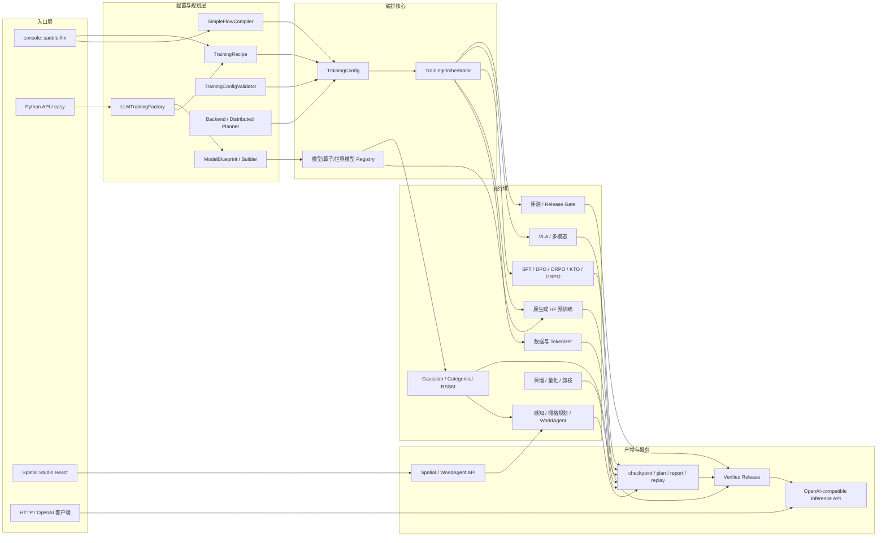

图中最重要的边界有三条：

1. `SimpleFlow` 与 `TrainingRecipe` 只是两种输入语法，最终都必须编译为 `TrainingOrchestrator` 接受的规范配置。
2. `ModelBlueprint` 是设计时模型结构；`SaddleModelConfig`/`SaddleForCausalLM` 是运行时模型结构，二者不能混为一层。
3. `SpatialWorldModelCoordinator` 负责单次空间组合；`WorldAgentRuntime` 在其外面增加有状态协议、持久化、仿真和真实反馈闭环。

## 4. 分层逻辑

### 4.1 入口与公共 API

核心文件：`setup.py`、`saddlellm/__init__.py`、`saddle_llm/__init__.py`、`saddlellm/cli.py`、`saddlellm/easy.py`。

- `setup.py` 注册 `saddle-llm` 和 `saddlellm` 两个 console script，二者都进入 `saddlellm.cli:main`。
- `saddlellm.__init__` 定义约 330 个公共符号，但用 `_LAZY_IMPORT_MAP` 延迟导入，避免仅 `import saddlellm` 就加载 Torch、Transformers、FastAPI 等重依赖。
- `saddle_llm` 不重复实现业务，只把旧命名空间的属性、版本、公开名和子模块搜索路径转发给 `saddlellm`。
- `cli.main` 只负责参数声明与命令分派；每个 `_cmd_*` 函数负责把 CLI 参数转换为领域入口调用，并用退出码区分成功/失败。
- `easy.py` 是便捷门面，适合交互式实验；稳定生产链仍应优先走配置、校验和 orchestrator。

CLI 命令按职责分为：

| 类别 | 命令 |
|---|---|
| 工作区/配置 | `init`、`import-data`、`create-recipe`、`plan`、`validate-config`、`preflight` |
| 训练/检查 | `train`、`doctor`、`smoke-test`、`inspect-data`、`inspect-vla` |
| 世界模型 | `train-world-model`、`world-model-backends`、`infer-world-model` |
| 空间智能 | `build-spatial-world-data`、`evaluate-spatial-world-model`、`plan-spatial-route`、`spatial-studio`、`world-agent-run`、`world-agent-api` |
| 发布/服务 | `report`、`export-model`、`serve-model` |

### 4.2 配置、工厂与规划

核心文件：`TrainingFactory.py`、`TrainingRecipe.py`、`SimpleFlow.py`、`TrainingConfigValidator.py`、`TrainingPlanEstimator.py`、`DatasetManifest.py`、`FactoryBackendPlanner.py`、`BackendAdapters.py`。

#### SimpleFlow

`SimpleFlowCompiler` 面向最常见的 `sft+dpo+eval+export` 流程：

1. 解析 `flow` 字符串并去重；`full` 展开为 SFT、对齐、评测、导出。
2. 拒绝当前尚未接入的 `grpo`/`serve` 短流程 token 和互斥的 `dpo+kto`。
3. 将扁平、易写的字段编译成规范的 `model/data/training/distributed/eval/export` 配置。
4. 将 `dpo`/`kto` 统一映射为 orchestrator 的 `preference` stage。

#### TrainingRecipe

`TrainingRecipe` 是完整、强类型的用户配方：

1. `from_dict/load` 把 YAML/JSON 解析为各子配置 dataclass。
2. `stages` 根据 stage 和 eval 开关得到有序阶段。
3. `_resolve_sources` 从内联 sources 或 `DatasetManifest` 产生统一数据源。
4. `_resolve_distributed` 在 `strategy=auto` 时调用 `FactoryBackendPlanner` 估算并行策略。
5. `_compile_*` 为每一种 stage 生成 orchestrator 专用子配置。
6. `compile/save_compiled` 输出唯一的执行契约。

#### LLMTrainingFactory

`LLMTrainingFactory` 是“项目生成器 + 高层计划器”，不直接替代训练执行器：

- 创建标准工作区和工厂说明；
- 导入数据 manifest；
- 生成 SFT/preference/MOPD/VLA/pretrain/模型结构实验计划；
- 在计划阶段做数据规范化、资源估算和配置落盘；
- 最终仍把真实执行交给 `TrainingOrchestrator` 或专用世界模型入口。

#### 校验和启动计划

- `TrainingConfigValidator` 在加载大模型前检查 stage、数据、训练步数、模型后端、release gate、VLA 动作空间等静态契约。
- `TrainingPlanEstimator` 给出有效 batch、token/step 等确定性估算，不宣称真实耗时精度。
- `FactoryBackendPlanner` 根据参数量、显存、GPU 数、序列长度和训练阶段推荐并行策略。
- `BackendAdapterRegistry` 把规范配置转换为单机、torchrun、DeepSpeed 等启动计划和 PowerShell 脚本。
- `DistributedRuntime` 是真实运行时保护层；规划上存在某个并行策略，不代表运行时已经支持它。

### 4.3 编排核心

核心文件：`TrainingOrchestrator.py`。

`TrainingOrchestrator` 是全框架调用图的枢纽：

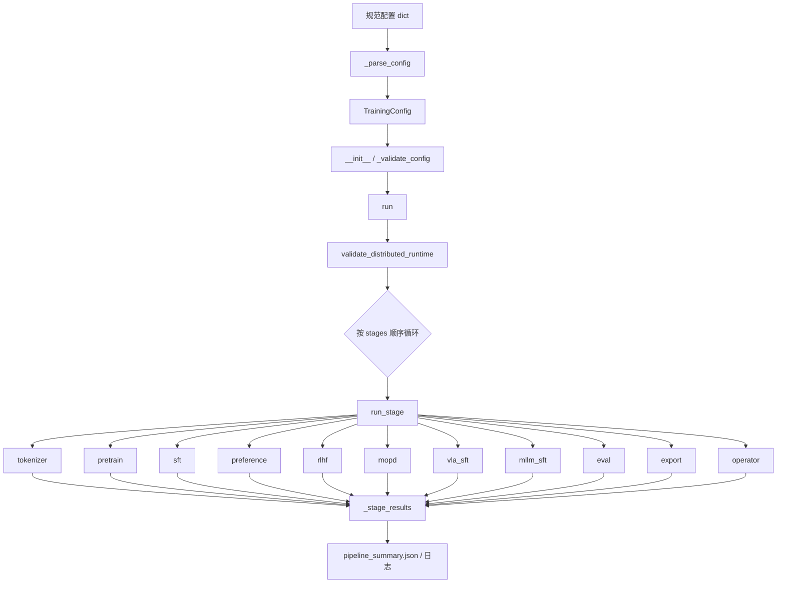

执行语义：

- stage 严格按用户给出的顺序运行，后段通过 `_stage_results` 获取上游 `model_path` 或 `data_path`。
- 流水线失败时记录 `failed_stage` 和错误，输出汇总，随后重新抛出；CLI 再转为结构化失败响应。
- 目前只有 `pretrain` 被声明为分布式安全；非单进程运行时，其他 stage 会 fail closed。
- `dry_run`/`preflight_only` 对 SFT、preference、RLHF、export 写计划但不训练/导出；它们不是静默成功的假训练。

当前 stage 的真实边界：

| Stage | 当前行为 | 主要执行器 |
|---|---|---|
| `tokenizer` | 执行训练和评估；无训练配置时加载已有 tokenizer | `TokenizerTrainer` |
| `pretrain` | 执行 scratch、续训或精确 resume；可走 HF 或原生 Saddle 模型 | HF `Trainer` / `SaddleTrainer` |
| `sft` | 执行 Full/LoRA/QLoRA SFT；先做数据 preflight | `PeftSFTTrainer.train_model` |
| `preference` | 执行 DPO/ORPO/KTO | `Preference.train_preference` |
| `rlhf` | DPO 可执行；PPO 返回 `planned_unsupported` | `Preference`（DPO） |
| `mopd` | 默认 dry-run；关闭 dry-run 且有 prompts/teacher 时收集 on-policy 数据 | `MultiTeacherOnPolicyDistiller` |
| `vla_sft` | 总会规划/规范化；`vla.train=true` 且数据存在时执行行为克隆 | `VLATrainer` |
| `mllm_sft` | 当前只规范化数据并物化训练计划 | `MultimodalDataAdapter` |
| `eval` | 执行指标评测并生成 release gate | `Evaluator`、`EvaluationReleaseGate` |
| `export` | gate 通过后打包、校验 release；dry-run 时只写计划 | `ModelExporter` |
| `operator` | 执行外部 agent 算子或本地大模型算子 | `saddle_ml.agent` / `RealWorldOperators` |

### 4.4 数据与 Tokenizer

核心文件：`DataPipeline.py`、`DataStrategy.py`、`DatasetManifest.py`、`DataCatalog.py`、`DataBalance.py`、`TextProcess.py`、`PostTrainingData.py`、`TrainingDataInspector.py`、`TokenizerTrainer.py`、`TokenizerLoader.py`。

预训练数据链：

```text
DataSourceConfig[]
  → DataPipeline.collect()
  → clean()
  → deduplicate()
  → filter_quality()
  → tokenize_and_pack(tokenizer)
  → to_iterable_dataset()
  → Trainer
```

- `DatasetManifest` 把数据名称、路径、role、格式和权重转成 Saddle data sources。
- `DataCatalog` 描述经典数据集及质量类别，本身不承诺自动下载。
- `DataStrategy` 负责训练语料配比、污染检查和规模计划。
- `PostTrainingDataAdapter` 将 Alpaca、messages、prompt/completion、chosen/rejected、KTO 等输入归一为训练器需要的 schema。
- `TrainingDataInspector` 在模型加载前抽样检查路径、JSONL、字段、空值和任务契约；不通过就阻断后训练。
- `TokenizerTrainer` 负责训练、保存和基础评估；`TokenizerLoader` 兼容标准 tokenizer 目录与仅有 `tokenizer.json` 的轻量目录。

### 4.5 模型蓝图、构建与原生运行时

核心文件：`ModelRegistry.py`、`ModelBlueprint.py`、`ModelBuilder.py`、`SaddleModeling.py`、`OperatorBackends.py`、`ModelLoader.py`、`NativeTrainer.py`、`ModelMetrics.py`。

模型有三种表达，职责不同：

| 表达 | 用途 | 关键类型 |
|---|---|---|
| 预设规格 | 快速选择已知规模/架构并估算参数与 token | `ModelSpec`、`MODEL_SPECS`、`ModelRegistry` |
| 设计蓝图 | 可序列化、可分析、支持异构层组合的结构描述 | `ModelBlueprint`、`LayerBlueprint`、`SaddleModelBuilder` |
| 运行时模型 | 真正参与 forward/backward/generate/save/load 的 Torch 模型 | `SaddleModelConfig`、`SaddleForCausalLM` |

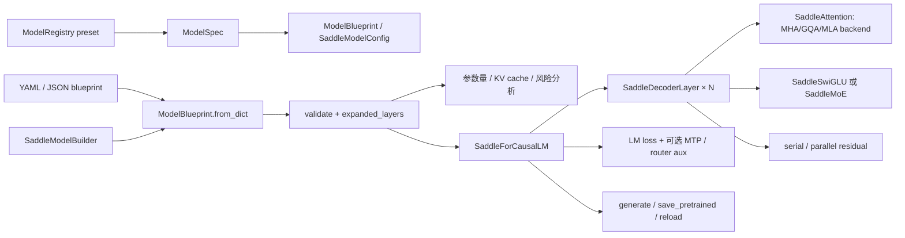

关键运行逻辑：

- `ModelComponentRegistry` 注册 attention、FFN、residual preset；返回独立副本，避免配置串改。
- `SaddleModelBuilder` 用链式 API 组合默认组件和异构层段，最终仍走 `ModelBlueprint.from_dict` 的同一套规范化和校验。
- `ModelBlueprint.validate` fail early：维度、头数、MLA/MoE/MTP、残差拓扑、长上下文等未实现或冲突选项不能静默降级。
- `SaddleAttention` 完成 Q/K/V、RoPE、KV cache、mask 和注意力后端调用。
- `SaddleMoE` 完成路由、top-k expert、全局负载统计、辅助损失或 aux-loss-free bias 更新。
- `SaddleForCausalLM.forward` 贯穿 embedding、异构 decoder layer、norm、lm_head 和各类损失；`generate` 提供原生自回归生成。
- `ModelLoader.load_causal_lm` 先只读判断本地目录是否满足原生 checkpoint 契约；是则加载 `SaddleForCausalLM`，否则交给 HF `AutoModelForCausalLM`。
- `SaddleTrainer` 把原生 checkpoint 保存/恢复契约接到 Hugging Face Trainer 生命周期。

### 4.6 训练与对齐执行器

这一层是 orchestrator 的“叶子节点”，每个模块聚焦一种算法或运行后端。

- 预训练：`DensePretrainer`、`pretrain`、`PretrainExperimentRunner`、`PretrainStability`、`PretrainEvalSuite`、`PretrainReport`。
- SFT/兼容后端：`PeftSFTTrainer`、`LoRATuner`、`PromptTuner`、`TRLFullFineTuner`、`SwiftFullFineTuner`、`UnslothFineTuner`、`UnslothSFTTrainer`。
- 偏好与 RL：`Preference`、`GRPOTrainer`、`RLScaling`、`RLHFTrainer`、`PublicPolicyRLVR`、`PublicPolicySFT`。
- 前沿/实验性对齐：`FrontierAlign`、`AdvancedTechniques`、`ExclusiveTechniques`。
- 多模态/VLA：`VisionBackbones`、`MultimodalProjector`、`MultimodalModeling`、`MultimodalData`、`VLA`、`VLATrainer`。
- On-policy 蒸馏：`OnPolicyDistillation`；通用和快速蒸馏则在 `UniversalDistiller`、`RapidDistill`。

这些模块并非都处于同一成熟度。架构上以 `TrainingOrchestrator` stage 表中的“真实行为”为准，不能仅因某类/文件存在就推断 CLI 主线已经自动接入。

### 4.7 评测、发布和推理

核心文件：`LLModelEvalute.py`、`BenchmarkRunner.py`、`ReleaseGate.py`、`ModelExporter.py`、`InferenceServer.py`、`ModelLoader.py`、`TokenizerLoader.py`。

发布链遵守“评测决定能否发布，导出负责形成可复现目录，服务只加载完整 release”的职责分离：

```text
上游 model_path
  → Evaluator.evaluate()
  → EvaluationReleaseGate.evaluate()
  → release_gate.json
  → ModelExporter.export()
  → 文件清单/可选哈希/加载校验/发布说明
  → load_inference_model()
  → LocalGenerationEngine
  → /v1/models、/v1/chat/completions、/v1/completions
```

- gate 启用且未接受时，export fail closed。
- 原生 Saddle checkpoint 保持原生格式，不伪装成 Hugging Face release；LoRA adapter 可按配置合并。
- `InferenceServer` 是 OpenAI 兼容、当前非流式的本地服务；API key 从指定环境变量读取，CLI 不接收明文密钥。
- `LocalGenerationEngine` 负责 chat template、输入长度限制、生成参数、stop 截断和输出 token 统计。

### 4.8 蒸馏、压缩、安全和观测

- 蒸馏：`UniversalDistiller`、`RapidDistill`、`DistillationTrainer`、`distill`。
- 量化：`ModelQuantizer`、`quantize`。
- 剪枝：`ModelPruner`、`prune`。
- 组合门面：`Lightweight`、`Deploy`。
- 安全生成：`SafeGenerate` 处理反重复和输出过滤，但不等于完整内容安全系统。
- 观测与实验：`ExperimentTracker`、`TrainingMonitor`、`monitordashbord`、`TrainerUtils`、`SmokeTestRunner`、`CurriculumScheduler`、`ScalingLawAnalyzer`。

这一组多数是独立工具，不全部经过 orchestrator；使用时应以相应公共函数的输入/输出契约为准。

### 4.9 原生世界模型

核心文件：`_WorldModel.py`、`_CategoricalWorldModel.py`、`WorldModelBackends.py`、`WorldModelData.py`、`_WorldModelTrainer.py`、`WorldModelInference.py`。

两种后端共享训练/推理门面：

- Gaussian RSSM：连续随机状态，实现在 `_WorldModel.WorldModel`。
- Categorical RSSM：DreamerV3 风格离散随机状态、symlog/two-hot value 头，实现在 `_CategoricalWorldModel.CategoricalWorldModel`。
- `WorldModelBackends` 负责后端名称规范化、创建、列举和从 checkpoint 自动加载。
- `WorldModelTrajectoryDataset` 读取 episode JSONL，生成固定窗口和 mask，并推断 observation/action 维度。
- `WorldModelTrainer` 负责优化循环、AMP、梯度裁剪、学习率、验证、checkpoint、best model 和训练历史。
- `WorldModelRuntime` 负责 observation 编码、belief filter、action-conditioned rollout、候选动作评分和 CEM/离散规划。

模型内部的共同信息流：

```text
observation_t → encoder → RSSM posterior
state_t + action_t → recurrent prior → state_(t+1)
state feature → observation/reward/continue/(collision/occupancy/motion) heads
候选 action sequence → imagine() → predicted return/risk → planner 选优
```

### 4.10 空间世界模型与 WorldAgent

核心文件：`SpatialPerception.py`、`SpatialPlanner.py`、`SpatialWorldModel.py`、`SpatialWorldModelControl.py`、`SpatialWorldModelData.py`、`SpatialWorldModelEvaluation.py`、`SpatialVisualization.py`、`SpatialAPI.py`、`WorldAgent.py`、`WorldAgentAPI.py`。

#### 单次空间规划

1. `TopDownMapExtractor` 将俯视图亮度和阈值转换为 FREE/BLOCKED/UNKNOWN 占用栅格。
2. 可选 `QwenVLSpatialAnalyzer` 产生图像类型、实体、危险和未知区域等语义；几何路径不依赖它也能工作。
3. `SpatialWorldModelCoordinator` 解析像素坐标或实体名，把端点吸附到可通行格。
4. `GridPathPlanner` 用 A* 和多样性惩罚产生 Top-K 可通行候选路线。
5. 可选 `WorldModelRouteScorer` 把路线编码为动作序列，经 RSSM 想象后按回报、几何代价和碰撞风险重排。
6. `SpatialVisualization` 输出 JSON、HTML、PNG 和 occupancy mask。

#### 有状态 WorldAgent

`WorldAgentRuntime` 把上述能力拆成可复用的四阶段协议：

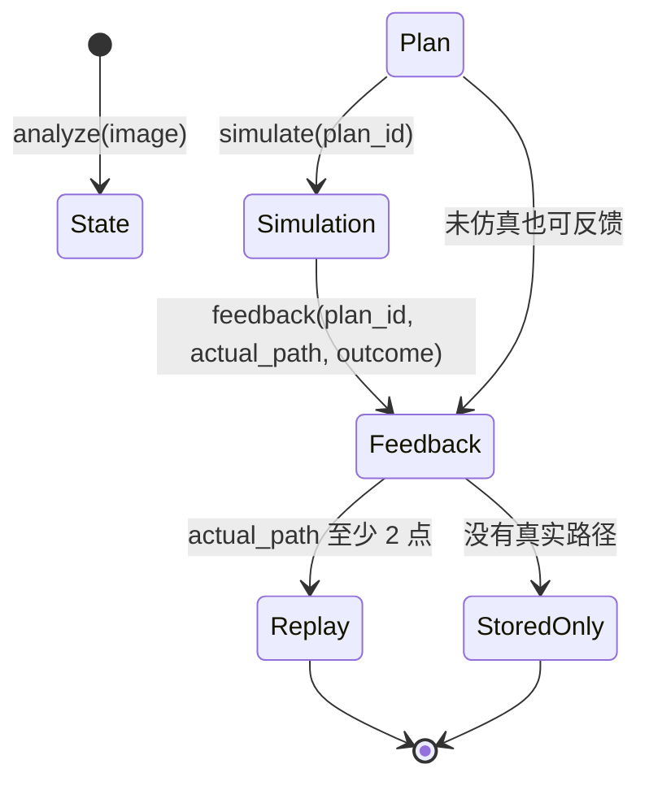

- `WorldAgentStore` 将 state、plan、simulation、feedback 分目录保存为 JSON；大栅格用 RLE 编码。
- 几何仿真验证路线是否越界/碰撞/到达目标；世界模型仿真提供未校准的 open-loop latent imagination。
- 只有包含至少两个真实路径点的 feedback 才写入训练 replay；没有真实轨迹的评价只保存，不污染训练集。
- 单张透视图默认不能被当作完整导航地图，除非显式开启近似模式。

### 4.11 Spatial Studio 前后端

后端 `SpatialAPI.create_spatial_studio_app` 同时安装：

- `/api/*`：面向工作台的一次性空间规划、demo、job 和 artifact API；
- `/v1/world/*`：面向 agent 客户端的 analyze/plan/simulate/feedback 协议；
- 构建后的 React 静态文件及 SPA fallback。

`SpatialStudioService.plan_bytes` 的职责是请求级编排和安全边界：上传大小、像素数、坐标范围、job id、懒加载锁、临时产物清理、错误结构化。

React `App` 是页面状态所有者：

- 启动时并发读取 capabilities 和 demo；
- 保存图层/规划偏好到本地存储，route/tab 写入 URL；
- 上传文件后本地预览，点击地图设置起终点；
- `handlePlan` 组装 `SpatialPlanRequest`，用 `AbortController` 取消旧请求；
- `MapCanvas` 负责图像、栅格/实体/路线 SVG 图层和点选；
- `WorkflowPanel` 管参数和操作，`InspectorPanel` 展示路线/模型/诊断，`StatusBar` 显示 online/stale/planning/error。

## 5. 关键时序图

### 5.1 `saddle-llm train` 总时序

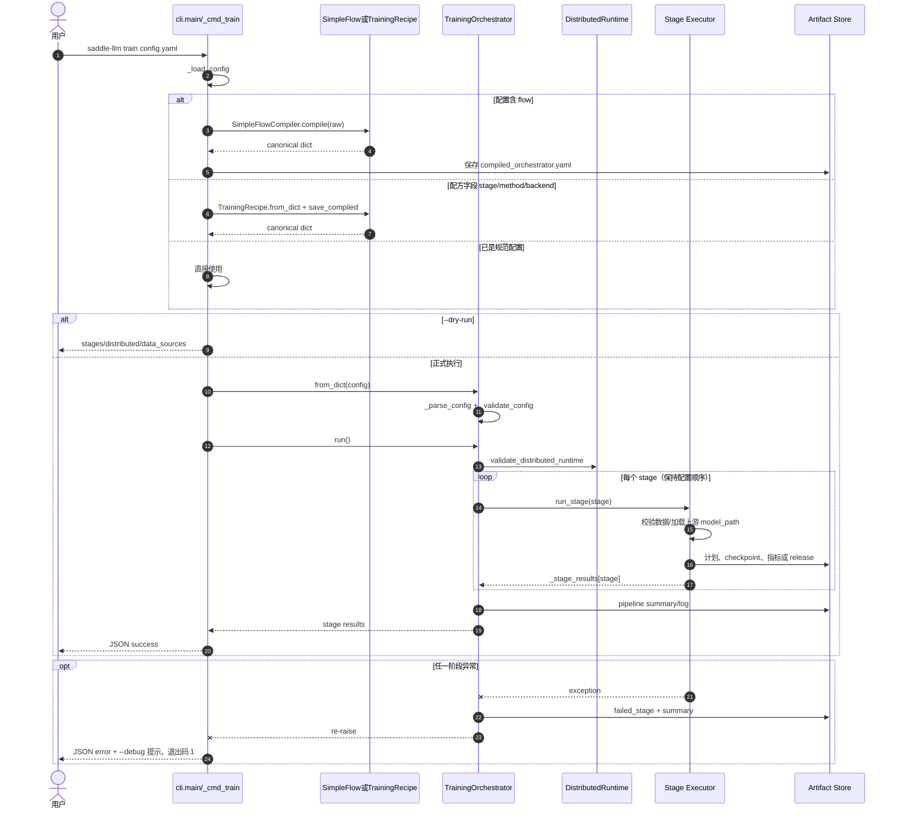

### 5.2 预训练 stage 时序

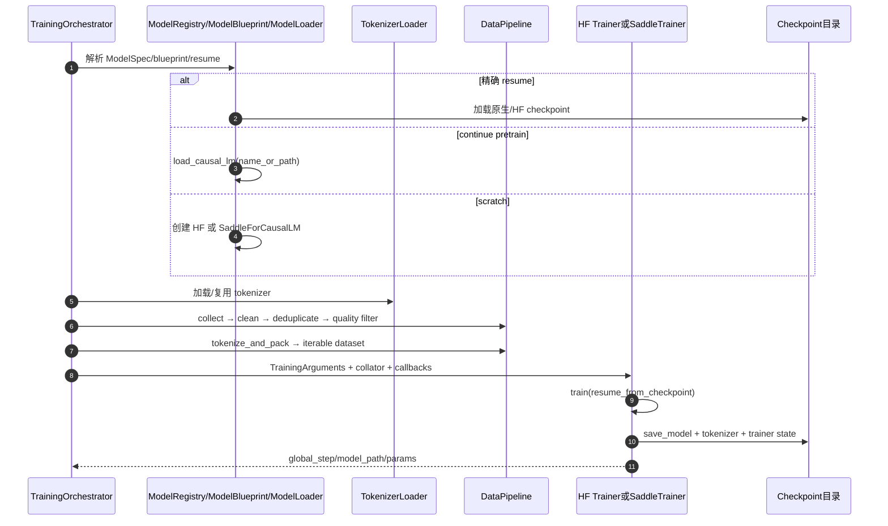

### 5.3 SFT → Preference → Eval → Export 时序

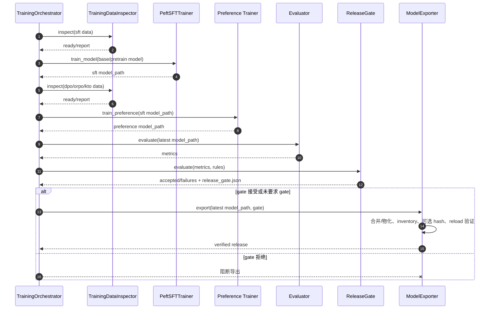

### 5.4 世界模型训练与推理时序

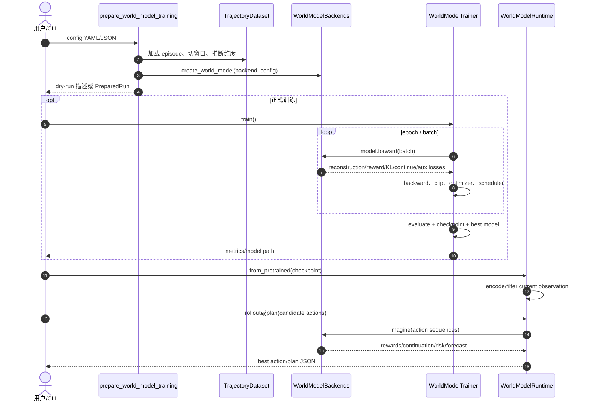

### 5.5 Spatial Studio 一次规划时序

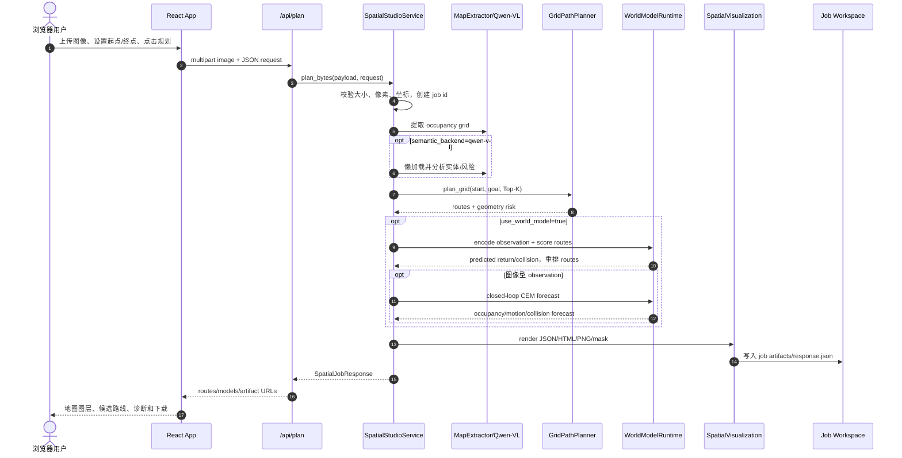

### 5.6 WorldAgent 闭环时序

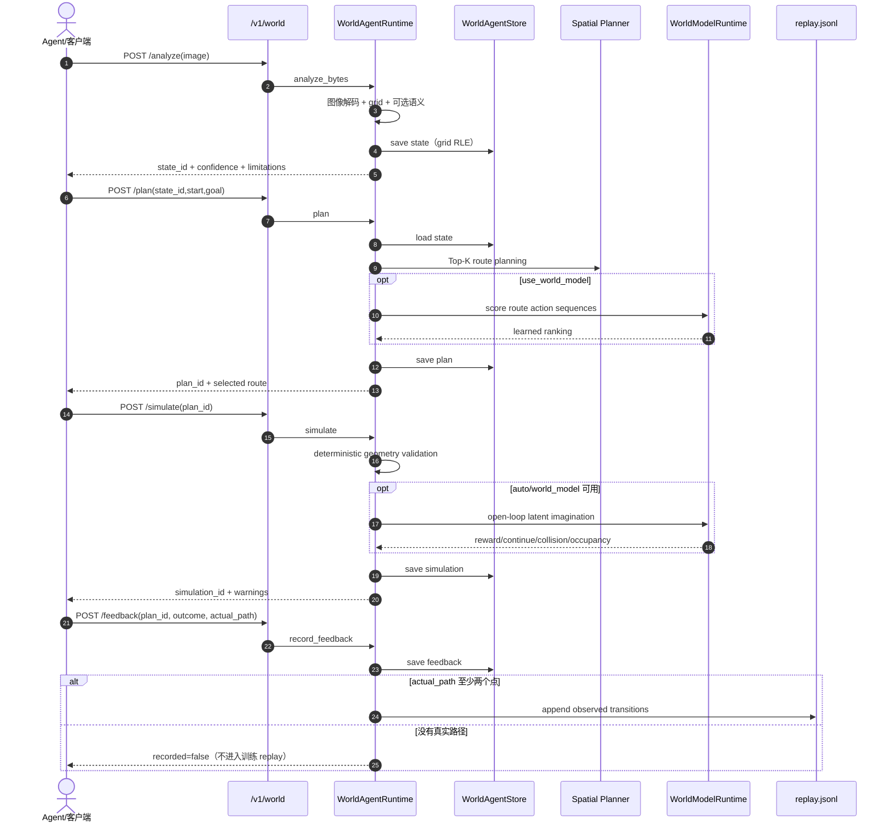

### 5.7 OpenAI 兼容推理时序

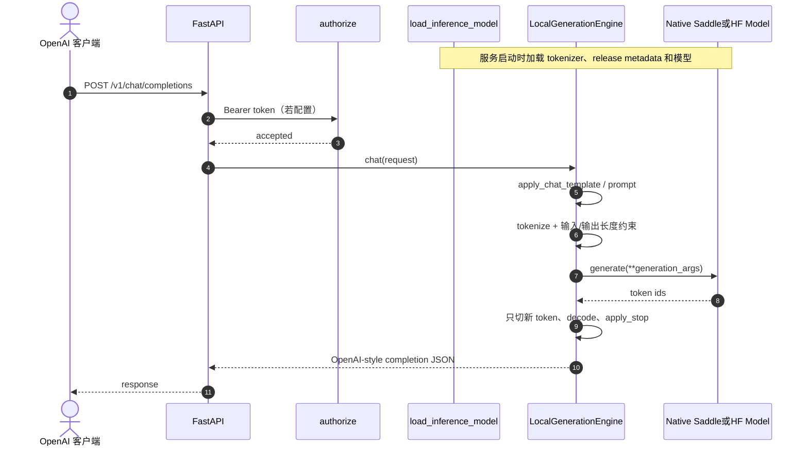

## 6. 模块地图

下面按“主要职责”归类；跨层依赖以实际 import 和 orchestrator 调用为准。

| 模块组 | 文件 | 逻辑 |
|---|---|---|
| 公共入口/兼容 | `__init__`、`cli`、`easy`、`saddle_llm/__init__` | 延迟导出、命令分派、便捷 API、旧包名转发 |
| 工厂/配方/编排 | `TrainingFactory`、`TrainingRecipe`、`SimpleFlow`、`TrainingOrchestrator`、`DomainBuilder` | 用户意图转规范配置，再按 stage 执行 |
| 静态检查/资源计划 | `TrainingConfigValidator`、`TrainingPlanEstimator`、`TrainingStrategyAdvisor`、`FactoryBackendPlanner`、`BackendAdapters`、`Architecture` | 可执行性、规模、后端和架构能力判断 |
| 分布式 | `DistributedConfig`、`DistributedRuntime` | 训练参数转换、进程组状态、barrier 和 fail-closed 检查 |
| 数据 | `DataPipeline`、`DataStrategy`、`DataCatalog`、`DataBalance`、`DatasetManifest`、`TextProcess`、`PostTrainingData`、`TrainingDataInspector` | 收集、清洗、配比、manifest、格式规范化和 preflight |
| Tokenizer | `TokenizerTrainer`、`TokenizerLoader` | 训练/评估/保存及兼容加载 |
| 模型设计 | `ModelRegistry`、`ModelBlueprint`、`ModelBuilder`、`ModelExperimentPlanner`、`OperatorBackends` | 规格、蓝图、组件组合、对照实验和算子后端 |
| 原生 Causal LM | `SaddleModeling`、`ModelLoader`、`NativeTrainer`、`ModelMetrics` | 原生 Transformer、统一加载、Trainer 生命周期、MoE/模型指标 |
| 预训练 | `DensePretrainer`、`pretrain`、`PretrainExperimentRunner`、`PretrainEvalSuite`、`PretrainReport`、`PretrainStability` | 训练、实验网格、评测、报告和稳定性 |
| SFT/偏好/RL | `PeftSFTTrainer`、`Preference`、`GRPOTrainer`、`RLScaling`、`RLHFTrainer`、`PublicPolicyRLVR`、`PublicPolicySFT` | SFT、离线偏好优化、GRPO/RL 工具和领域 pilot |
| 对齐实验 | `FrontierAlign`、`AdvancedTechniques`、`ExclusiveTechniques`、`OnPolicyDistillation` | 宪法式对齐、EMA/自洽、MTP/MoE 技术、on-policy 多教师蒸馏 |
| 多模态/VLA | `VisionBackbones`、`MultimodalProjector`、`MultimodalModeling`、`SaddleMultimodalModeling`、`MultimodalData`、`VLA`、`VLADataInspector`、`VLATrainer` | 视觉编码、projector、VLM 包装、动作 token 和行为克隆 |
| 世界模型 | `_WorldModel`、`_CategoricalWorldModel`、`WorldModelBackends`、`WorldModelData`、`_WorldModelTrainer`、`WorldModelInference` | RSSM 模型、数据、训练、保存/加载、rollout 与规划 |
| 空间智能 | `SpatialPerception`、`SpatialPlanner`、`SpatialWorldModel`、`SpatialWorldModelControl`、`SpatialWorldModelData`、`SpatialWorldModelEvaluation`、`SpatialVisualization` | 图像到栅格、Top-K A*、RSSM 评分/MPC、数据生成、评测、可视化 |
| Agent/API | `WorldAgent`、`WorldAgentAPI`、`SpatialAPI` | 有状态闭环、HTTP 协议、Studio 请求级编排 |
| 评测/发布/服务 | `LLModelEvalute`、`BenchmarkRunner`、`ReleaseGate`、`ModelExporter`、`InferenceServer` | 指标、发布门禁、可验证 release、OpenAI 兼容服务 |
| 压缩/部署 | `UniversalDistiller`、`RapidDistill`、`DistillationTrainer`、`distill`、`ModelQuantizer`、`quantize`、`ModelPruner`、`prune`、`Lightweight`、`Deploy` | 蒸馏、量化、剪枝和部署门面 |
| 安全/观测/工具 | `SafeGenerate`、`ExperimentTracker`、`TrainingMonitor`、`monitordashbord`、`TrainerUtils`、`SmokeTestRunner`、`CurriculumScheduler`、`ScalingLawAnalyzer` | 输出过滤、实验追踪、训练诊断、smoke、课程和 scaling law |
| 外部/旧后端适配 | `AgentModelProvider`、`AgentOperators`、`RealWorldOperators`、`PostTrainingCompatibility`、`LLMLoader`、`load_model`、`LoRATuner`、`PromptTuner`、`TRLFullFineTuner`、`SwiftFullFineTuner`、`UnslothFineTuner`、`UnslothSFTTrainer` | 外部模型/agent/训练后端兼容以及旧 API 保留 |

## 7. 产物和状态契约

| 产物 | 生产者 | 消费者 |
|---|---|---|
| `compiled_orchestrator.yaml/json` | `SimpleFlowCompiler` / `TrainingRecipe` | `TrainingOrchestrator`、launch script |
| `backend_plan.json` / `launch_plan.json` / `launch.ps1` | backend planner/adapter | 用户、调度环境 |
| stage plan JSON | orchestrator 各后训练 stage | preflight、审计、用户 |
| `final_model/` / stage checkpoints | Trainer | 后续 stage、Evaluator、Exporter |
| `release_gate.json` | `EvaluationReleaseGate` | `ModelExporter` |
| verified release directory | `ModelExporter` | `InferenceServer`、部署系统 |
| world-model checkpoint/config/history | `WorldModelTrainer` | `WorldModelRuntime`、Spatial runtime |
| spatial job `source/plan/mask/response` | `SpatialStudioService` | React Studio、下载者 |
| states/plans/simulations/feedback JSON | `WorldAgentStore` | WorldAgent 后续阶段和查询 API |
| replay JSONL | `record_feedback` | 世界模型训练数据管线 |

## 8. 重要设计约束和风险边界

1. **规划不等于执行。** `planning_only`、`planned`、`planned_unsupported` 必须原样展示，不能在上层 UI 中包装成“训练完成”。
2. **只有 pretrain 声明为分布式安全。** 其他 stage 应拆成单进程流水线，直到各 trainer 明确接入分布式语义。
3. **原生与 HF checkpoint 不同。** 原生模型以 `saddle_config.json + pytorch_model.bin` 识别；不完整目录会直接报错，不能回退成 HF 模型。
4. **多模态主线仍有边界。** VLA 可在显式开关下训练；通用 `mllm_sft` 当前是数据规范化与计划物化。
5. **PPO 尚未接线。** `rlhf.method=ppo` 只产生不支持状态；稳定离线 RLHF 路径是 DPO/preference。
6. **世界模型分数不是安全证明。** learned return/collision 未校准；空间系统仍保留几何可通行性和 limitation/warning。
7. **真实反馈与模型想象严格区分。** 只有真实 `actual_path` 进入 replay，预测路径不能当训练真值。
8. **单张透视图信息不足。** 默认拒绝把透视图静默当作完整俯视导航图。
9. **文档索引是静态近似。** 动态 import、框架 callback、反射和 monkey patch 需要运行时 tracing 才能补全。

## 9. 测试如何保护架构

当前测试不是平均覆盖全部实验模块，而是重点保护主合同：

- 配置与后训练：simple flow 编译、真实 tiny post-training smoke、release gate/export/server。
- 原生模型：蓝图等价、异构层、残差、MoE、gradient checkpoint、checkpoint 生命周期。
- 分布式：CPU gloo DDP 对齐、rank-zero manifest、精确 resume、FSDP 配置和未支持 hybrid fail-closed。
- 世界模型：Gaussian/Categorical RSSM、训练、保存加载、rollout、连续/离散规划。
- 空间智能：A* Top-K、语义坐标、轨迹生成、CEM、评测、API 产物。
- WorldAgent：RLE 状态、四阶段 HTTP 协议、仿真、反馈 replay 污染保护。
- 公共政策 RLVR/GRPO：答案抽取、奖励、拆分、采样和梯度累积。

建议文档校验与主测试一起运行：

```powershell
python tools/generate_function_reference.py --check
python -m pytest -q
```

## 10. 函数级索引

完整的逐函数说明在 [FUNCTION_REFERENCE.md](FUNCTION_REFERENCE.md)，其内容包括：

- 所有 Python 模块级函数、类方法和具名嵌套函数；
- Spatial Studio 中排除测试后的具名组件、函数、Hook 回调和构造器；
- 源码行链接和完整签名；
- 优先采用 docstring、否则按命名和上下文生成的职责说明；
- Python 函数体静态可见的直接调用（最多十个）。

更新源码后执行：

```powershell
python tools/generate_function_reference.py
```

这保证“每个函数的意义”不是一次性人工清单，而是可持续跟随源码变化的文档产物。
