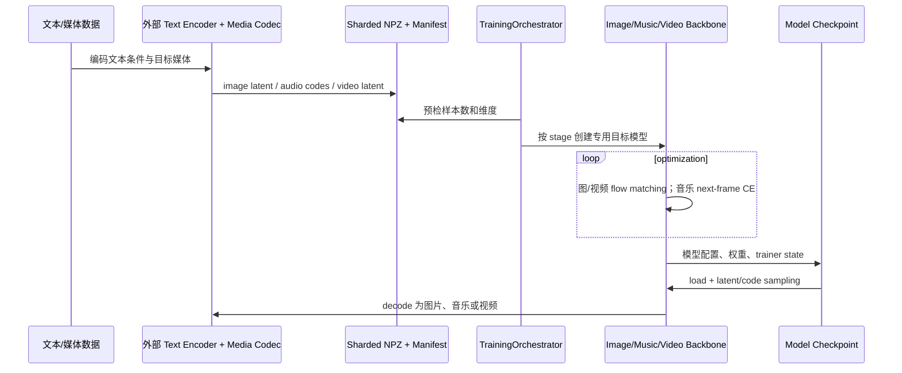
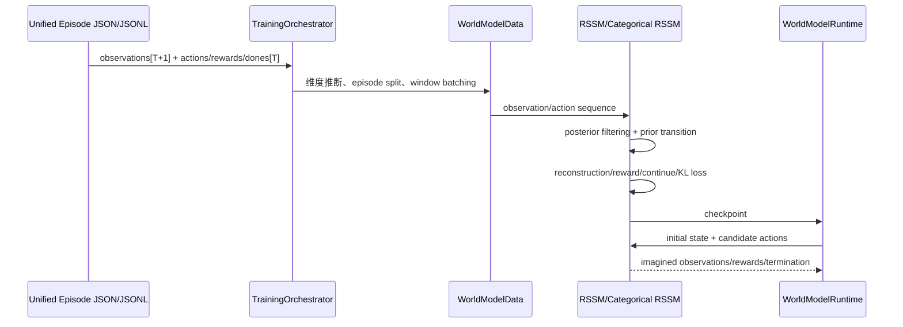

# SaddleLLM 生成式多模态基础架构

## 设计边界

文本生成、媒体生成和世界动力学共享数据与编排契约，但不共享同一种输出损失：

- 文本使用自回归 next-token objective。
- 图像使用 codec latent 上的 flow-matching objective。
- 音频使用多码本自回归 audio-code Transformer。
- 视频使用 3D patch 时空 latent flow Transformer。
- 世界模型必须额外消费 action，并预测 future state、reward、termination 和 uncertainty。

## 统一样本

```json
{
  "schema_version": 2,
  "sample_id": "episode-001",
  "messages": [{"role": "user", "content": "<video>\n继续这个场景"}],
  "segments": [
    {
      "modality": "video",
      "role": "observation",
      "uri": "input.mp4",
      "start_time": 0.0,
      "end_time": 2.0,
      "codec": "causal-video-vae-v1"
    }
  ],
  "observations": [[0.0, 0.0], [0.1, 0.0]],
  "actions": [[0.0, 1.0]],
  "rewards": [1.0],
  "dones": [true],
  "timestamps": [0.0, 1.0],
  "provenance": {"dataset": "example"},
  "license": "dataset-specific"
}
```

`images` 字段继续由标准化器生成，用于兼容现有 VLM/VLA 代码。

## 统一生成调用链



## 原始媒体缓存

默认安装现在包含三种能真正编解码的基线 Codec：

- `baseline-rgb-image`：图片 resize 后映射为 `[-1,1]` RGB latent；
- `baseline-wav-rvq`：读取 PCM WAV、重采样、分帧并执行残差标量量化，同时保存有效帧 `attention_mask`；
- `baseline-frame-video`：读取帧目录或 GIF/WebP，均匀采样后形成 `[C,T,H,W]` latent。

它们用于验证数据、训练和 checkpoint 的完整链路，不代表生产质量。生产训练应通过 `ModalityCodecRegistry` 或 `plugin_modules` 换成图像 VAE、神经音频 Codec 和因果视频 VAE。

缓存构建使用 `shard-00000.npz` 等分片及 `manifest.json`。manifest 保存输入文件 SHA-256、Codec/文本编码器指纹、数组形状和范围、每个 shard 的 SHA-256、处理进度及失败记录。已完成缓存重复执行会直接复用；身份变化会拒绝续建。

```powershell
saddle-llm media-codecs
saddle-llm build-media-cache configs\media_cache_image.yaml
saddle-llm train configs\raw_image_to_training.yaml
```

原始清单最小格式：

```json
{"prompt":"一只雨中的猫","image":"images/cat.png"}
{"prompt":"轻柔的钢琴旋律","audio":"audio/piano.wav"}
{"prompt":"日落延时摄影","video":"frames/sunset"}
```

## 世界模型调用链



## 当前已完成与未完成

已完成：

- 模态无关 `segments` 和 episode 字段；
- codec 插件注册契约；
- 原始媒体到原子分片缓存、manifest、数据指纹与安全续建；
- 确定性 hash 文本条件编码器和可选 Hugging Face encoder；
- 内置图像、WAV 音频、帧视频基线 Codec；
- 图像 latent flow loss、采样、训练、checkpoint；
- 音乐多码本 AR loss、生成、训练、checkpoint；
- 视频 3D patch 时空 latent flow、采样、训练、checkpoint；
- 编排器 `image_generation`、`music_generation`、`video_generation` stage；
- RSSM/离散 RSSM 的统一 `world_model` stage 与 episode 数据契约；
- 原生文本 SFT/DPO 闭环。

尚未完成：

- 生产级图像 VAE、神经音频 Codec 与因果视频 VAE 适配器；
- classifier-free guidance、EMA、分布式 flow 训练；
- FID/CLIP/aesthetic/human preference 评测；
- 多进程/多 GPU cache builder 与对象存储数据源；
- 长视频分块、首尾帧/参考图条件和 A/V 同步；
- 通用世界模型的 action-conditioned 视频 latent dynamics。
